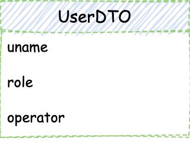

## 简介
Umajs 是一个简单易用、扩展灵活，基于 TypeScript 的 Node.js Web 框架。

从 2018 年立项至今，Umajs 团队持续的对框架打磨、迭代，在生产环境稳定运行近两年后，于 2020 年 8 月份开源。

说到这儿各位朋友没准儿想问：这个框架是怎么个简单易用法？扩展灵活是不是开发团队自己吹的？

接下来我们就带着这两个疑问一起往下走，看看 Umajs 到底是不是真的做到了简单、灵活。

## 核心优势
首先，Umajs 的核心优势体现在以下几个方面：

- **参数装饰器** 内置丰富的参数装饰器，同时也支持自定义参数装饰器；通过参数装饰器可以快速的提取、校验、转换、聚合用户输入为我们所需要的格式；
- **统一返回** 通过统一返回机制，我们可以快速的对返回结果进行修改；当然框架也支持普通的返回方式；
- **切面** 运用切面机制可以显著提高代码的可复用性、降低业务逻辑之间的耦合度；Umajs 可以轻松的将中间件转换为切面方法以便于复用 Koa 社区丰富的中间件资源；
- **依赖注入** 依赖注入在降低业务逻辑耦合度的同时，还对性能有一定的提升；

经过上述一番介绍，相信各位对 Umajs 有了些许印象：什么装饰器、AOP、IOC 堆在一起，还有个没怎么听说过的统一返回。

开发团队为什么把这些特性称之为 Umajs 的核心优势？这些所谓的优势有是怎么帮助我们提升开发效率的呢？

口说无凭，我们一起来通过示例代码了解一下。

## 处理用户输入
开始之前我们先对 Controller 的功能做一个简单的定义： 处理用户输入，返回处理结果给用户。

而 Umajs 内置了丰富的装饰器用于处理用户的输入。
### 数据获取
举例来说有如下请求：

```
    GET /users/10269?role=admin
```
上述请求对应的路由 `path` 是 `/users/:id`,`role=admin` 是这个请求的 QueryString。

在 Umajs 中我们可以通过内置的参数装饰器 `@Param` 获取路由参数，通过 `@Query` 获取 QueryString 上的 value，代码示例如下：

```ts
// controller/index.controller.ts
@Path('/users/:id')
getUser(@Param('id') uid: string, @Query('role') role: string) {    
    // 查询过程略
    return Result.json({ uid, role });
}
```
参数装饰器 `@Param('id') uid: string` 的参数 `id` 代表待获取参数的 key，返回值 `uid` 代表待获取参数的 value，返回值可以直接在方法里使用。

同样的，对于 `POST` 请求，框架提供了 `@Body` 装饰器来快捷获取body数据。

通过框架内置的这些参数装饰器获取参数称的上是轻巧快捷了，但是参数装饰器的功能不仅于此，框架还提供了自定义参数装饰器的功能以便于针对不同的业务场景做定制化处理。接下来我们看一下如何实现自定义参数装饰器：
```ts
// decorator/MyQuery.ts
import { createArgDecorator, IContext } from '@umajs/core';

export const MyQuery = createArgDecorator(
    (ctx: IContext, key: string) => ctx.query[key],
);
```
通过示例代码我们可以看到，使用 `createArgDecorator` 能够很轻松的创建自定义参数装饰器：它接收一个函数作为参数，这个函数有 `context` 和 `key` 两个参数，`key` 作为一个可选参数代表我们想在自定义参数装饰器中获取的参数字段，这样我们就能在 `context` 上获取相应的数据。示例代码实现了一个简易的 `@Query` 参数装饰器，实际应用中我们能做的功能不止于此。

### 数据检查与转换

```ts
// decorator/AgeCheck.ts
export const AgeCheck = createArgDecorator(
    (ctx: IContext, ageKey: string) => {
        let age = ctx.query[ageKey];

        if (age === undefined) {
            return Result.json({
                code: 0,
                msg: '请加上 age 参数',
            });
        }

        age = +age;

        if (Number.isNaN(age) || age < 0 || age > 120) {
            return Result.json({
                code: 0,
                msg: '请传入正确的 age 参数',
            });
        }
        return age;
    }
);
```
在这段示例中我们对输入的年龄数据进行了提取与检查，如果没有传递年龄参数、或者传递的年龄参数不符合预期，则返回相应的提示信息给用户。推而广之，我们在实际应用中可以对任何需要检查的字段使用自定义参数装饰器进行校验，而这些校验逻辑是可以轻松复用的。

在实际应用中我们还有如下场景，前端传递的是 yyyy-MM-dd 格式的日期数据，而数据库或者第三方服务需要的是时间戳格式，那么我们也可以在自定义参数装饰器中对其进行转换：

```TS
// decorator/DateCheck.ts
export const DateCheck = createArgDecorator(
    (ctx: IContext, dateKey: string) => {
        const dateStr = ctx.query[dateKey];
        // 转换 yyyyMMdd 为时间戳
        return dateStrToTimestamp(dateStr);
    },
);
```

有了以上两个参数装饰器，`GET /age?age=22&date=2020-10-10` 这个请求我们就可以在 Controller 的方法中使用它们来进行数据检查与转换，而 Controller 方法则专注于具体业务逻辑的处理，从而实现关注点分离：

```ts
@Path('/age')
age(@AgeCheck('age') age: number, @DateCheck('date') date: string) {
    return Result.send(`date is ${date}, age is ${age}`);
}
```

实际上除了 `@Param`、`@Query` 外，Umajs 还通过扩展包 `@umajs/arg-decorator` 提供了丰富的常用参数装饰器：

|修饰器| 使用说明 | 
---|---
@Body(id?:string or Function or string[]) | POST请求参数修饰器 `@Body() body:object `  or `@Body('id') id:any` or  `@Body(['name','age']) user: {name:any,age:any}` 
@Require(id: string,message?:string) | url参数修饰并做必填校验
@ToNumber(id: string,message?: string) | 参数修饰并类型转换为number类型  类型转换失败则会终止函数执行并返回提示内容
@ToBoolean(id: string,message?: string) |参数修饰并类型转换布尔类型 类型转换失败则会终止函数执行并返回提示内容
@ToArray(id: string, split?:string ,message?: string) |参数修饰并类型转换数组 类型转换失败则会终止函数执行并返回提示内容
@ToDate(id: string,message?: string) | 参数修饰并类型转换为date类型  类型转换失败则会终止函数执行并返回提示内容 备注：参数接受如果为数字也会按照时间强制转换为时间格式。
@Equals(id: string,comparison?: any) | 参数修饰并做值对比校验
@NotNull(id: string,message?: string) |	限制必须不为null 
@AssertFalse(id: string,message?: string) |		限制必须为false
@AssertTrue(id: string,message?: string)	 |	限制必须为true
@DecimalMax(id: string,value: number,message?: string) |		限制必须为一个不大于指定值的数字
@DecimalMin(id: string,value: number,message?: string) |		限制必须为一个不小于指定值的数字
@Future(id: string,message?: string)	 |	限制必须是一个将来的日期
@Max(id: string,value: number,message?: string)	 |	限制必须为一个不大于指定值的数字
@Min(id: string,value: number,message?: string)	 |	限制必须为一个不小于指定值的数字
@Past(id: string,message?: string)	 |	限制必须是一个过去的日期
@Pattern(id: string,pattern: RegExp,message?: string)	 |	限制必须符合指定的正则表达式
@Size(id: string,max: number,min: number,message?: string)	 |	限制字符长度必须在min到max之间
@NotEmpty(id: string,message?: string) 	 |		验证注解的元素值不为null且不为空（字符串长度不为0、集合大小不为0）
@NotBlank(id: string,message?: string)	 |	验证注解的元素值不为空（不为null、去除首位空格后长度为0），不同于@NotEmpty，@NotBlank只应用于字符串且在比较时会去除字符串的空格
@Email(id: string,message?: string) |		验证注解的元素值是Email
@Phone(id: string,message?: string) | 验证元素值是手机号 具体格式参考`https://github.com/validatorjs/validator.js/blob/master/src/lib/isMobilePhone.js`


[内置参数装饰器参考文档](https://umajs.gitee.io/other/ArgDecorator.html#api)


### 数据聚合
通过以上几个示例，相信大家对于 Umajs 参数装饰器的便捷之处有了一定的认识。然而实际开发中我们还需要面对一些更复杂的场景。举例来说，第三方接口所需的 DTO（Data Transfer Object）其属性一部分可能来自于 param、query，另一部分则可能来自于 Cookie 甚至是第三方服务。

例如下面 `UserDTO` 中，`uname` 来自于 param，`role` 则来自于 query，而 `operator` 则是根据 Cookie 从 sso service 中获取：



此时我们可以使用自定义参数装饰器来封装这些繁琐的、从不同地方获取字段值的操作：

```TS
// decorator/UserDTO.ts
export const GetUser = createArgDecorator(
    (ctx: IContext) => {
        const user = new UserDTO();

        user.uname = ctx.param.uname;
        user.role = ctx.query.role || 'user';
        user.operator = ctx.uid || 10269;

        return user;
    },
);
```
在 Controller 方法里直接通过 `@GetUser` 获取并使用相应的 DTO 实例：
```TS
// controller/index.controller.ts
@Path('/user/:uname')
addUser(@GetUser() dto: UserDTO) {
    const data = this.userService.addUser(dto);

    return Result.json(data);
}
```

### 参数装饰器小结

<br>


<br>

通过以上几个示例为大家展示了 Umajs 参数装饰器是如何实现对参数的快速获取、校验、转换及聚合。针对常用场景 Umajs 提供了一系列的内置参数装饰器。


针对复杂场景我们可以通过自定义一个强大的参数装饰器以实现获取、校验、聚合一体，从而分离业务逻辑与其它逻辑，实现代码灵活复用。


## 返回处理结果

### 拦截并替换返回值

我们先看一段示例代码：

```ts
// decorator/AgeCheck.ts
export const AgeCheck = createArgDecorator(
    (ctx: IContext, ageKey: string) => {
        let age = ctx.query[ageKey];

        if (age === undefined) {
            return Result.json({
                code: 0,
                msg: '请加上 age 参数',
            });
        }

        age = +age;

        if (Number.isNaN(age) || age < 0 || age > 120) {
            return Result.json({
                code: 0,
                msg: '请传入正确的 age 参数',
            });
        }
        return age;
    }
);
```

想必朋友们也发现了，又是这个 `AgeCheck` 的代码。放心，代码没有粘错😁 。在这个章节里我们的关注点和上一章有所不同：相信大家都注意到了，当参数校验未通过的时候，我们通过 `return Result.json(data)` 这段代码把对应的错误信息抛给了接口。

这就是 Umajs 的统一返回机制: 在 Controller 的方法里返回 `Result` 而不是直接操作 `context`。统一返回本质上仍是对如下传统方式的包装，并且 Umajs 仍然支持传统的方式。

```TS
ctx.body = 'happy hacking';
ctx.status = 200;
```

但是传统方式如果想通过装饰器对返回结果进行修改是比较麻烦的，而使用了统一返机制则相当简单。譬如上述 `AgeCheck` 装饰器，在校验未通过后可以直接返回 `Result`，这个返回值代替了被修饰的 Controller 方法的返回值；对比在没有统一返回的情况下，是不是方便了很多？

### 修改当前返回值

`AgeCheck` 装饰器演示了对返回值的替换，接下来我们探讨一下如何修改返回值：

```TS
export default class implements IAspect {
    @Inject(Timestamp)
    timestamp: Timestamp;

    async around(proceedPoint: IProceedJoinPoint<any>) {
        const { proceed, args } = proceedPoint;
        const result = await proceed(...args);
        result.stamp = this.timestamp.getTimestamp();

        return result;
    }
}
```
上述代码是一个切面方法，该方法为返回值增加了一个时间戳字段。是不是很轻松就实现了对返回值的修改？

> 关于切面以及 `@Inject` 装饰器会在稍后讨论。

### 统一返回内置类型及扩展

为了便于使用，Umajs 的统一返回机制封装了常用的返回类型，如：
- json
- view
- redirect
- stream
- jsonp
- download
- send

假如上述这些返回类型仍不足以应对某些场景，那么统一返回也支持通过插件的方式自定义扩展返回类型：


> 插件相关会在稍后讨论。

### 统一返回机制小结

以上几个示例介绍了 Umajs 的统一返回机制， 以及如何通过参数装饰器拦截返回值、通过切面方法修改返回值；统一返回机制内置了常用的返回类型，并且支持通过插件进行扩展。统一返回机制的意义不仅在于它封装了常见的返回类型，更重要的是，通过它我们能够对返回值进行便捷的干涉以应对不同的业务场景。

## 切面

### 切面的执行

在上一章中我们演示了如何使用切面，Aspect，修改了返回值。Aspect 是 AOP 思想的一种具体实现。在 Umajs 中 Aspect 的执行顺序如下：


可以看到，切面有如下几个方法：

- around 环绕通知
- before 前置通知
- after 后置通知
- afterReturing 最终通知
- afterThrowing 异常通知

首先执行 around 的 before 部分，接下来执行 before ，然后是目标方法的执行；

如果目标方法执行异常，则执行 after，然后执行 afterThrowing；

如果目标方法执行成功，则执行 around 的 after 部分，然后执行 after，最后在目标方法成功返回后执行 afterReturning；

多个 Aspect 的执行顺序为包裹型。

结合示意图来看，相信大家对 `Aspect.around` 这个切面方法有一种莫名的亲切感对不对？没错，它与 Koa 大名鼎鼎的**洋葱模型**基本一致。

### 切面的使用
```TS
// aspect/test.aspect.ts
export default class implements IAspect {
    before() {
        console.log('test: this is before');
    }
    // 其它通知略
}
// controller/index.controller.ts
@Aspect.before('test')
export default class Index extends BaseController {
    @Aspect('auth')
    @Path('/users/:id')
    getUser(@Param('id') uid: string, @Query('role') role: string) {
        // 其它代码略
        return Result.json({ role });
    }
}
```
通过上述示例代码，可以看得出：
- `@Aspect` 装饰器既可以修饰类，也可以修饰类的方法；
- `@Aspect` 修饰类的时候，对类的所有方法都生效；
- `@Aspect` 既可以默认使用所有通知，也可以通过 `@Aspect.before` 这种方式指定特定的通知；

### Aspect.around

在 Aspect 的五种通知中，，从它们的函数签名就可以看得出,`Aspect.around` 是比较特别的一个。在 Umajs 中，它也是唯一一个能够修改返回值的通知类型：

```TS
export interface IAspect {
    before?(point: IJoinPoint): void;
    after?(point: IJoinPoint): void;
    around?(proceedPoint: IProceedJoinPoint): Promise<Result>;
    afterReturning?(point: IJoinPoint, val: any): void;
    afterThrowing?(err: Error): void;
}

export interface IProceedJoinPoint<T = any> extends IJoinPoint<T> {
    proceed(...props: any[]): Promise<any>;
}

export interface IJoinPoint<T = any> {
    target: T;
    args: Array<any>;
}
```

为什么只有 `Aspect.around` 能够修改返回值呢 ？ 通过函数签名我们看得出 `Aspect.around` 的切点类型相比其他通知多了一个 `proceed`。这个函数就是被环绕通知所修饰的目标方法，执行这个函数自然会返回目标方法的返回值，那么我们在 `Aspect.around` 这里修改目标方法的返回值是不是也显得和合理呢？

另一方面，它的特别之处还在于它和 Koa 中间件一样都属于洋葱模型。接下来我们对比一下这两者。

共同点：
- 两者都是洋葱模型，包裹现有方法；
- 他们都能够拦截现有方法、进行错误处理等等；

差异点：
- `Aspect.around` 针对目标方法生效，而中间件针对请求生效；
- `Aspect.around` 能够对目标方法的参数和返回结果进行修改，而中间件无法处理这些；

而为了利用 Koa 社区丰富的中间件资源，Umajs 提供了 `middlewareToAround` 方法，通过这个方法我们能够以 `Aspect.around` 的方式来使用中间件：


```TS
import { IAspect, middlewareToAround } from '@umajs/core';
import mw from 'demo-middleware';
// aspect/middleware.aspect.ts
export default class implements IAspect {
    around = middlewareToAround（mw()）
}
```

这种转换方式适用于有局部加载需求的中间件，转换后不但代码结构更加清晰，其性能也有一定的提升。

而对于有全局加载需求的中间件，可以通过 Umajs 的插件形式来使用中间件。

### 切面应用场景


Aspect 的应用场景可以说是非常广泛，除了我们之前提到的对于参数、返回值的处理，还有例如埋点\日志、性能监控、事务性操作等等。


### 切面小结

以上几个示例介绍了：
- Umajs 的 Aspect 执行机制；
- Aspect 的多种使用方式；
- `Aspect.around` 这个通知的强大之处以及它与 Koa 中间件的异同；
- `middlewareToAround` 方法能够将中间件快速转换为 `Aspect.around`；
- 对于有全局加载需求的中间件，可以通过 Umajs 的插件形式来使用中间件。


## 参数装饰器、统一返回、切面小结


在以上三个小节中，我们为大家分别演示讲解了 Umajs 的参数装饰器、统一返回和切面以及他们的应用。

实际开发中，丰富的参数装饰器快速处理输入 + 统一返回机制提供输出 + Aspect 按需修改修改参数、返回值的有机结合，可以说是能够轻松应对绝大多数的复杂业务场景。这也是我们为什么敢自称 Umajs 是一个简单好用的框架。

而且无论是参数装饰器还是统一返回机制都提供了强大的自定义方法，在框架本身不满足业务需求的情况下，能够灵活的进行自定义扩展。

## 插件

Umajs 插件的机制借用了 Koa 中间件机制，这也是为什么我们可以通过简单的配置就能够在 Umajs 中以插件的形式使用 Koa 中间件。在其基础之上 Umajs 将插件机制实现为框架级扩展方案：例如通过复合插件实现对 `context`、`request`、`response`、`results` 的扩展等等。

### 中间件转插件
在 Umajs 中以插件的方式使用中间件是非常简单的事情：

首先在插件中引入中间件，并且根据场景简单的声明其配置项；
```TS
// plugins/test/index.ts
import mw from '../../utils/mw';

export default (uma: Uma, options: any = {}): TPlugin => {
    return {
        use: {
            handler: mw,
        },
    };
};

// config/plugin.config.ts
'test': {
    enable: true,
},
```
然后在插件配置文件中设置其配置项，这个中间件就生效了。


### 插件实现返回类型扩展

在统一返回机制一节，我们提到过，当内置的返回类型不足以满足业务场景的时候可以通过插件机制来自定义返回类型。

如果想要扩展返回类型，那么我们首先要自定义一个继承自 `Result` 的类，在这个类中声明我们所期望返回类型对应的方法：
```TS
// plugin/result/index.ts
import { IContext, TPlugin, Result as R } from '@umajs/core';

export class Result extends R {
    static redirect2(url: string, status: number) {
        return new Result({
            type: 'redirect2',
            data: {
                url,
                status,
            },
        });
    }
}
```
然后通过插件来实现这个具体的方法：

```TS
export default (): TPlugin => ({
    results: {
        redirect2(ctx: IContext, data: TRedirect2) {
            const { url, status } = data;

            ctx.redirect(url);
            ctx.status = status;
        },
    },
});
```

在 `config` 中配置该插件后就可以使用新增的方法了：

```TS
// config/plugin.config.ts
export default {
    'result': true,
}

// controller
redirect(@Require('url', '跳转的 url 未定义') url:string) {
    // 使用扩展后的 Result 进行带状态码的重定向
    return Result.redirect2(url, 301);
}
```

### 复合插件其它应用

刚刚我们通过扩展返回类型的示例演示了如何使用复合插件扩展框架。但是复合插件的应用不仅于此，还提供了 `use`、`filter`、`ignore`、`method` 四种局部加载的配置形式。感兴趣的同学可以参考文档：


[插件开发参考文档](https://umajs.gitee.io/%E5%9F%BA%E7%A1%80%E5%8A%9F%E8%83%BD/Plugin.html#%E6%8F%92%E4%BB%B6%E5%BC%80%E5%8F%91)

### 插件小结

Umajs 使用插件进行框架层面拓展:
- 可以轻松使用已有的中间件；
- 可以采用复合模式对  `context`、`request`、`response`、`results` 进行扩展；
- 可以对中间件的使用场景进行快速开发，例如:
    - `filter` 对符合条件的路由加载中间件；
    - `ignore` 对符合条件之外的路由加载中间件；
    - `method` 对 MethodType 符合的请求加载中间件；


## 调用服务/公共方法

在统一返回的示例中我们使用了 `@Inject`装饰器。这个装饰器用于对公共方法的调用。

通常我们会将一些通用的业务逻辑或者更底层的操作封装为服务、工具类等以便于在其他地方调用。

先来看一段示例代码：

```TS
// controller/user.controller.ts
import Timestamp from '../utils/timestamp';
import UserService from '../service/user.service';

export default class User extends BaseController {
    @Inject(Timestamp)
    timestamp: Timestamp;

    @Service(UserService)
    userService: UserService;

    @Path('/users/:id')
    getUser(@Param('id') uid: string, @Query('role') role: string) {
        const stamp = this.timestamp.getTimestamp();
        const user = this.userService.getUserById(uid, stamp);

        return Result.json({ ...user, role });
    }
}
```
上述示例代码中我们使用了两个装饰器 `@Inject` 和 `@Service`。通过这两个装饰器我们快速的获取了对应工具类和服务类的实例。那么问题来了，这两个装饰器是怎么做到快速获取到类的实例呢？

### IOC
实际上 `@Inject` 和 `@Service` 装饰器是 IOC 机制的应用。IOC 意为控制反转，它是依赖倒置原则的一种实现方式，也就是面向接口编程。IOC 的实现借助于第三方容器，可以解耦具有依赖关系的对象，降低开发维护成本。


例如系统内有如上 A、B、C、D 四个模块，它们相互依赖，就像四个咬合在一起的齿轮组。而这样一个系统，如果其中一个模块发生了异常，那么可能导致整个系统都不可用。这也就是代码耦合度过高带来的问题。


### 依赖注入
IOC 常见的实现方式、也是 Umajs 所采用的方式，是依赖注入。顾名思义是把高层模块所依赖的低层模块注入进来：


高层次模块脱离了业务逻辑转而成为了低层次模块的容器，而低层次模块则面向接口编程：满足对高层次模块初始化的接口的约定即可。这就是控制反转：通过注入依赖将控制权交给被依赖的低层级模块。

在引进了上图中间的容器之后，几个齿轮之间不再互相咬合、变成了齿轮之间相互独立但都与容器咬合。

依赖注入有很多实现方式，比较典型的是构造函数注入和类属性注入。出于对 TypeScript 支持等原因 Umajs 采用了类属性注入的方案，但构造函数注入的方案也有很多优秀的实现，感兴趣的同学可以自行了解一下。

Umajs 提供了 `@Resource` 和 `@Inject` 来实现 IOC 容器和依赖注入。使用 `@Resource` 修饰的类，框架启动时将会在 IOC 容器中加入一个该类的实例。`@Inject` 则可以将相应的示例注入到指定的变量中。

所以上述示例中 `@Inject` 完整示例如下：
```ts
// utils/index.ts
@Resource()
export default class Timestamp {
    getTimestamp(date: Date = new Date()) {
        return date.valueOf();
    }
}
// controller
export default class User extends BaseController {
    @Inject(Timestamp)
    timestamp: Timestamp;
    //...
}
```

而 `@Service` 则是 Umajs 提供的特殊注入装饰器，用于快速获取 `service` 实例，这个装饰器只能在继承自 BaseController 的类中使用。

在框架启动时会对代码进行扫描，当代码命名为 `*.service.ts` 且继承自 `BaseService` 时，会将其实例化并把实例放入 Service 容器中。因此 `@Service` 装饰器无需匹配的模块声明即可生效。

此外 `@Service` 修饰器所注入的实例还能够访问 `context` 对象，而通过 `@Resource` 修饰的类则不能。

## 异常处理

妥善的异常捕获与处理是程序稳定运行的重要保障。在 Umajs 中我们推荐使用以下几种方式进行错误处理：


他们的应用场景分别如下：

- try-catch: 适合对方法单独进行错误处理
- Aspect: 更具可复用性，可以对多个方法进行错误处理
- plugin-status: 对整个系统在运行中未被捕获的错误的兜底操作，让系统更健壮，同时除了错误处理外，更多的是对不同状态码的统一处理

## 小结

- 参数装饰器
- 统一返回机制
- Aspect
- 插件
- IOC
- 异常处理
