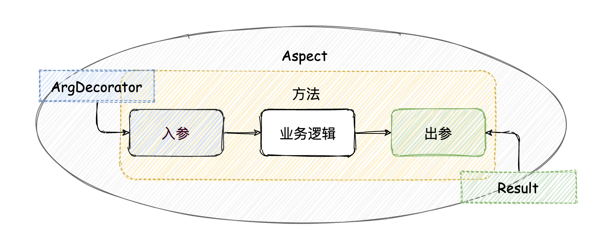

## 简介
Umajs 是一个简单易用、扩展灵活，基于 TypeScript 的 Node.js Web 框架。

从 2018 年立项至今，Umajs 团队持续的对框架打磨、迭代，在生产环境稳定运行近两年后，于 2020 年 8 月份开源。

说到这儿各位朋友没准儿想问：这个框架是怎么个简单易用法？怎么做到的扩展灵活？

接下来我们就带着这两个疑问一起往下看，看看 Umajs 到底是不是真的做到了简单、灵活。

## 核心优势
首先，Umajs 的核心优势体现在以下几个方面：

- **参数装饰器** 内置丰富的参数装饰器，同时也支持自定义参数装饰器；通过参数装饰器可以快速的提取、校验、转换、聚合用户输入为我们所需要的格式；
- **统一返回** 统一返回是 Controller 的便捷返回。通过统一返回机制，我们可以快速的对返回结果进行修改；当然框架也支持普通的返回方式；
- **切面** 运用切面机制可以显著提高代码的可复用性、降低业务逻辑之间的耦合度；Umajs 可以轻松的将中间件转换为切面方法以便于复用 Koa 社区丰富的中间件资源；
- **依赖注入** 依赖注入在降低业务逻辑耦合度的同时，还对性能有一定的提升；

经过上述一番介绍，相信各位对 Umajs 有了些许印象：什么装饰器、AOP、IOC 堆在一起，还有个没怎么听说过的统一返回。

开发团队为什么把这些特性称之为 Umajs 的核心优势？这些所谓的优势有是怎么帮助我们提升开发效率的呢？

口说无凭，我们一起来通过示例代码了解一下。

## 处理用户输入
开始之前我们先对 Controller 的功能做一个简单的定义： 处理用户输入，返回处理结果给用户。

而 Umajs 内置了丰富的装饰器用于处理用户的输入。

### 装饰器
我们先简单聊一下装饰器。

假设你今天晚上和朋友约了去打篮球，那你肯定是要带上篮球鞋过去的；但如果晚上要和女朋友共进烛光晚餐，那最好还是带上一束鲜花对不对？

而无论是 AJ 还是玫瑰，相对于你本人来说都是身外之物，但又切切实实的能对你有帮助：心爱的篮球鞋使得你气势+1、恰到好处的红玫瑰使你魅力+1，而机械键盘和降噪耳机则让你在敲代码写文档时如虎添翼。

这就是装饰器的应用：在不改变原对象的情况下，为原对象添加额外的功能、加个 BUFF。

ES7 中引入了 @decorator 修饰器的提案，TypeScript 已经支持了这个提案。

我们刚刚提到 Umajs 内置了丰富的装饰器，在处理用户输入方面，使用的是**参数装饰器**。
### 数据获取
举例来说有如下请求：

```
    GET /users/10269?role=admin
```
上述请求对应的路由 `path` 是 `/users/:id`,`role=admin` 是这个请求的 QueryString。

在 Umajs 中我们可以通过内置的参数装饰器 `@Param` 获取路由参数，通过 `@Query` 获取 QueryString 上的 value，代码示例如下：

```ts
// controller/index.controller.ts
@Path('/users/:id')
getUser(@Param('id') uid: string, @Query('role') role: string) {    
    // 查询过程略
    return Result.json({ uid, role });
}
```
参数装饰器 `@Param('id') uid: string` 的参数 `id` 代表待获取参数的 key，返回值 `uid` 代表待获取参数的 value，返回值可以直接在方法里使用。

同样的，对于 `POST` 请求，框架提供了 `@Body` 装饰器来快捷获取 body 数据。

通过框架内置的这些参数装饰器获取请求的参数称的上是轻巧快捷了，但是参数装饰器的功能不仅于此，框架还提供了自定义参数装饰器的功能以便于针对不同的业务场景做定制化处理。接下来我们看一下如何实现自定义参数装饰器：
```ts
// decorator/MyQuery.ts
import { createArgDecorator, IContext } from '@umajs/core';

export const MyQuery = createArgDecorator(
    (ctx: IContext, key: string) => ctx.query[key],
);
```
通过示例代码我们可以看到，使用 `createArgDecorator` 能够很轻松的创建自定义参数装饰器：它接收一个函数作为参数，这个函数有 `context` 和 `key` 两个参数，`key` 作为一个可选参数代表我们想在自定义参数装饰器中获取的参数字段，这样我们就能在 `context` 上获取相应的数据。示例代码实现了一个简易的 `@Query` 参数装饰器，实际应用中我们能做的功能不止于此。

### 数据检查与转换

```ts
// decorator/AgeCheck.ts
export const AgeCheck = createArgDecorator(
    (ctx: IContext, ageKey: string) => {
        let age = ctx.query[ageKey];

        if (age === undefined) {
            return Result.json({
                code: 0,
                msg: '请加上 age 参数',
            });
        }

        age = +age;

        if (Number.isNaN(age) || age < 0 || age > 120) {
            return Result.json({
                code: 0,
                msg: '请传入正确的 age 参数',
            });
        }
        return age;
    }
);
```
在这段示例中我们对输入的年龄数据进行了提取与检查，如果没有传递年龄参数、或者传递的年龄参数不符合预期，则返回相应的提示信息给用户。推而广之，我们在实际应用中可以对任何需要检查的字段使用自定义参数装饰器进行校验，而这些校验逻辑是可以轻松复用的。

在实际应用中我们还有如下场景，前端传递的是 yyyy-MM-dd 格式的日期数据，而数据库或者第三方服务需要的是时间戳格式，那么我们也可以在自定义参数装饰器中对其进行转换：

```TS
// decorator/ToTimestamp.ts
export const ToTimestamp = createArgDecorator(
    (ctx: IContext, dateKey: string) => {
        const dateStr = ctx.query[dateKey];
        // 转换 yyyyMMdd 为时间戳
        return dateStrToTimestamp(dateStr);
    },
);
```

有了以上两个参数装饰器，`GET /age?age=22&date=2020-10-10` 这个请求我们就可以在 Controller 的方法中使用它们来进行数据检查与转换，而 Controller 方法则专注于具体业务逻辑的处理，从而实现关注点分离：

```ts
@Path('/age')
age(@AgeCheck('age') age: number, @DateCheck('date') date: string) {
    return Result.send(`date is ${date}, age is ${age}`);
}
```

实际上除了 `@Param`、`@Query` 外，Umajs 还通过扩展包 `@umajs/arg-decorator` 提供了丰富的常用参数装饰器：

|修饰器| 使用说明 | 
---|---
@Body(id?:string or Function or string[]) | POST请求参数修饰器 `@Body() body:object `  or `@Body('id') id:any` or  `@Body(['name','age']) user: {name:any,age:any}` 
@Require(id: string,message?:string) | url参数修饰并做必填校验
@ToNumber(id: string,message?: string) | 参数修饰并类型转换为number类型  类型转换失败则会终止函数执行并返回提示内容
@ToBoolean(id: string,message?: string) |参数修饰并类型转换布尔类型 类型转换失败则会终止函数执行并返回提示内容
@ToArray(id: string, split?:string ,message?: string) |参数修饰并类型转换数组 类型转换失败则会终止函数执行并返回提示内容
@ToDate(id: string,message?: string) | 参数修饰并类型转换为date类型  类型转换失败则会终止函数执行并返回提示内容 备注：参数接受如果为数字也会按照时间强制转换为时间格式。
@Equals(id: string,comparison?: any) | 参数修饰并做值对比校验
@NotNull(id: string,message?: string) |	限制必须不为null 
@AssertFalse(id: string,message?: string) |		限制必须为false
@AssertTrue(id: string,message?: string)	 |	限制必须为true
@DecimalMax(id: string,value: number,message?: string) |		限制必须为一个不大于指定值的数字
@DecimalMin(id: string,value: number,message?: string) |		限制必须为一个不小于指定值的数字
@Future(id: string,message?: string)	 |	限制必须是一个将来的日期
@Max(id: string,value: number,message?: string)	 |	限制必须为一个不大于指定值的数字
@Min(id: string,value: number,message?: string)	 |	限制必须为一个不小于指定值的数字
@Past(id: string,message?: string)	 |	限制必须是一个过去的日期
@Pattern(id: string,pattern: RegExp,message?: string)	 |	限制必须符合指定的正则表达式
@Size(id: string,max: number,min: number,message?: string)	 |	限制字符长度必须在min到max之间
@NotEmpty(id: string,message?: string) 	 |		验证注解的元素值不为null且不为空（字符串长度不为0、集合大小不为0）
@NotBlank(id: string,message?: string)	 |	验证注解的元素值不为空（不为null、去除首位空格后长度为0），不同于@NotEmpty，@NotBlank只应用于字符串且在比较时会去除字符串的空格
@Email(id: string,message?: string) |		验证注解的元素值是Email
@Phone(id: string,message?: string) | 验证元素值是手机号 具体格式参考`https://github.com/validatorjs/validator.js/blob/master/src/lib/isMobilePhone.js`


[内置参数装饰器参考文档](https://umajs.gitee.io/other/ArgDecorator.html#api)


### 数据聚合
通过以上几个示例，相信大家对于 Umajs 参数装饰器的便捷之处有了一定的认识。然而实际开发中我们还需要面对一些更复杂的场景。举例来说，第三方接口所需的 DTO（Data Transfer Object）其属性一部分可能来自于 param、query，另一部分则可能来自于 Cookie 甚至是第三方服务。

例如下面 `UserDTO` 中，`uname` 来自于 param，`role` 则来自于 query，而 `operator` 则是根据 Cookie 从 sso service 中获取：


针对这种情况我们可以使用自定义参数装饰器来封装这些繁琐的、从不同地方获取字段值的操作：

```TS
// decorator/UserDTO.ts
export const GetUser = createArgDecorator(
    (ctx: IContext) => {
        const user = new UserDTO();

        user.uname = ctx.param.uname;
        user.role = ctx.query.role || 'user';
        user.operator = ctx.uid || 10269;

        return user;
    },
);
```
在 Controller 方法里直接通过 `@GetUser` 获取并使用相应的 DTO 实例：
```TS
// controller/index.controller.ts
@Path('/user/:uname')
async addUser(@GetUser() dto: UserDTO) {
    const data = await this.userService.addUser(dto);

    return Result.json(data);
}
```


针对复杂场景我们可以通过自定义一个强大的参数装饰器以实现获取、校验、聚合一体，从而分离业务逻辑与其它逻辑，实现代码灵活复用。

### 参数装饰器小结

<br>


<br>

通过以上几个示例为大家展示了 Umajs 参数装饰器是如何实现对参数的快速获取、校验、转换及聚合。针对常用场景 Umajs 提供了一系列的内置参数装饰器。

## 返回处理结果

### 拦截并替换返回值

我们先看一段示例代码：

```ts
// decorator/AgeCheck.ts
export const AgeCheck = createArgDecorator(
    (ctx: IContext, ageKey: string) => {
        let age = ctx.query[ageKey];

        if (age === undefined) {
            return Result.json({
                code: 0,
                msg: '请加上 age 参数',
            });
        }

        age = +age;

        if (Number.isNaN(age) || age < 0 || age > 120) {
            return Result.json({
                code: 0,
                msg: '请传入正确的 age 参数',
            });
        }
        return age;
    }
);
```

想必朋友们也发现了，又是这个 `AgeCheck` 的代码。放心，代码没有粘错😁 。在这个章节里我们的关注点和上一章有所不同：请大家注意，当参数校验未通过的时候，我们通过 `return Result.json(data)` 这段代码把对应的错误信息抛给了接口。

这就是 Umajs 的统一返回机制: 在 Controller 的方法里返回 `Result` 而不是直接操作 `context`。统一返回本质上仍是对如下传统方式的包装，并且 Umajs 仍然支持传统的方式。

```TS
ctx.body = 'happy hacking';
ctx.status = 200;
```

但是传统方式如果想对返回结果进行修改是比较麻烦的，而使用了统一返机制则相当简单。譬如上述 `AgeCheck` 装饰器，在校验未通过后可以直接返回 `Result`，这个返回值代替了被修饰的 Controller 方法的返回值；


在没有统一返回的情况下，如果想要拦截返回值，我们在 `AgeCheck` 装饰器中直接修改了 `ctx`；而在执行 Controller 方法的时候仍然会对 `ctx` 进行修改。而装饰器的执行机制决定了 `AgeCheck` 装饰器所修改的 `ctx` 会被目标方法的修改覆盖掉。如果在 `AgeCheck` 装饰器中主动抛出异常固然阻止了目标方法修改 `ctx`，但是又需要进行额外的异常处理；

对比之下，统一返回机制是不是方便了很多？

### 修改当前返回值

`AgeCheck` 装饰器演示了对返回值的替换，接下来我们探讨一下如何修改返回值：

```TS
export default class implements IAspect {
    @Inject(Timestamp)
    timestamp: Timestamp;

    async around(proceedPoint: IProceedJoinPoint<any>) {
        const { proceed, args } = proceedPoint;
        const result = await proceed(...args);
        result.stamp = this.timestamp.getTimestamp();

        return result;
    }
}
```
上述代码是一个切面方法，通过切面的 around 方法获取到了目标方法执行后的返回值，并且为这个返回值增加了一个时间戳字段。是不是很轻松就实现了对返回值的修改？

> 关于切面以及 `@Inject` 装饰器会在稍后讨论。

### 统一返回内置类型及扩展

为了便于使用，Umajs 的统一返回机制封装了常用的返回类型，如：
- json
- view
- redirect
- stream
- jsonp
- download
- send

假如上述这些返回类型仍不足以应对某些场景，那么统一返回也支持通过插件的方式自定义扩展返回类型：


> 插件相关会在稍后讨论。

### 统一返回机制小结

以上几个示例介绍了 Umajs 的统一返回机制， 以及如何在校验未通过等场景下使用参数装饰器拦截返回值、通过切面方法修改返回值；统一返回机制内置了常用的返回类型，并且支持通过插件进行扩展。统一返回机制的意义不仅在于它封装了常见的返回类型，更重要的是，通过它我们能够对返回值进行便捷的干涉以应对不同的业务场景。

## 切面

请问大家现在外出后回到家中第一件事情是什么？ 我想大部分人回家第一时间是洗手吧。那出门前的最后一件事呢？没错，是戴口罩。

戴口罩这个动作相对于出门这件事而言，就是切面。出门则是切点，在这个点的前后我们可以插入一些其他的动作，比如关灯、锁门等等。

这就是 AOP 面向切面编程，是对 OOP 的补充。利用 AOP 可以对业务逻辑的各个部分进行隔离，也可以隔离业务无关的功能，从而使得业务逻辑各部分之间的耦合度降低，提高业务无关的功能的复用性，也就提高了开发的效率。

在 Umajs 中使用了 Aspect 装饰器来实现 AOP。

### 切面的执行

在上一章中我们演示了如何使用切面，Aspect，修改了返回值。在 Umajs 中 Aspect 的执行顺序如下：


可以看到，切面有如下几个方法：

- around 环绕通知，包裹目标方法；
- before 前置通知，在目标方法之前执行；
- after 后置通知，在目标方法之后执行；
- afterReturing 最终通知，方法执行成功后执行该切面；
- afterThrowing 异常通知，处理未捕获的异常。

首先执行 around 的 before 部分，接下来执行 before ，然后是目标方法的执行；

如果目标方法的执行抛出了未捕获异常，则执行 after，然后执行 afterThrowing；

如果目标方法执行成功，则执行 around 的 after 部分，然后执行 after，最后在目标方法成功返回后执行 afterReturning；

多个 Aspect 的执行顺序为包裹型。

结合示意图来看，相信大家对 `Aspect.around` 这个切面方法有一种莫名的亲切感对不对？没错，它与 Koa 大名鼎鼎的**洋葱模型**基本一致。

### 切面的使用
```TS
// aspect/test.aspect.ts
export default class implements IAspect {
    before() {
        console.log('test: this is before');
    }
    // 其它通知略
}
// controller/index.controller.ts
@Aspect.before('test')
export default class Index extends BaseController {
    @Aspect('auth')
    @Path('/users/:id')
    getUser(@Param('id') uid: string, @Query('role') role: string) {
        // 其它代码略
        return Result.json({ role });
    }
}
```


切面的实现很简单，继承 `IAspect` 后实现基类的 `around`、`before` 等通知方法即可。


通过上述示例代码，可以看得出：

- `@Aspect` 装饰器既可以修饰类，也可以修饰类的方法；
- `@Aspect` 修饰类的时候，对类的所有方法都生效；
- `@Aspect` 既可以默认使用所有通知，也可以通过 `@Aspect.before` 这种方式指定特定的通知；

### Aspect.around

在 Aspect 的五种通知中，，从它们的函数签名就可以看得出,`Aspect.around` 是比较特别的一个。在 Umajs 中，它也是唯一一个能够修改返回值的通知类型：

```TS
export interface IAspect {
    before?(point: IJoinPoint): void;
    after?(point: IJoinPoint): void;
    around?(proceedPoint: IProceedJoinPoint): Promise<Result>;
    afterReturning?(point: IJoinPoint, val: any): void;
    afterThrowing?(err: Error): void;
}

export interface IProceedJoinPoint<T = any> extends IJoinPoint<T> {
    proceed(...props: any[]): Promise<any>;
}

export interface IJoinPoint<T = any> {
    target: T;
    args: Array<any>;
}
```

为什么只有 `Aspect.around` 能够修改返回值呢 ？ 通过函数签名我们看得出 `Aspect.around` 的切点类型相比其他通知多了一个 `proceed`。这个函数就是被环绕通知所修饰的目标方法，执行这个函数自然会返回目标方法的返回值，那么我们在 `Aspect.around` 这里修改目标方法的返回值是不是也显得和合理呢？

`Aspect.around` 的 `proceed` 和 Koa 中间件的 `next` 有异曲同工之处。

另一方面，它的特别之处还在于它和 Koa 中间件一样都属于洋葱模型。

共同点：
- 两者都是洋葱模型，包裹现有方法；
- 他们都能够拦截现有方法、进行错误处理等等；

差异点：
- `Aspect.around` 针对目标方法生效，而中间件针对请求生效；
- `Aspect.around` 能够对目标方法的参数和返回结果进行修改，而中间件无法处理这些；

而为了利用 Koa 社区丰富的中间件资源，Umajs 提供了 `middlewareToAround` 方法，通过这个方法我们能够以 `Aspect.around` 的方式来使用中间件：


```TS
import { IAspect, middlewareToAround } from '@umajs/core';
import mw from 'demo-middleware';
// aspect/middleware.aspect.ts
export default class implements IAspect {
    around = middlewareToAround（mw()）
}
```

这种转换方式适用于有局部加载需求的中间件，转换后不但代码结构更加清晰，其性能也有一定的提升。

而对于有全局加载需求的中间件，可以通过 Umajs 的插件形式来使用中间件。

### 切面应用场景


Aspect 的应用场景可以说是非常广泛，除了我们之前提到的对于参数、返回值的处理，还有例如埋点\日志、性能监控、事务性操作等等。


### 切面小结

以上几个示例介绍了：
- Umajs 的 Aspect 执行机制；
- Aspect 的多种使用方式；
- `Aspect.around` 这个通知的强大之处以及它与 Koa 中间件的异同；
- `middlewareToAround` 方法能够将中间件快速转换为 `Aspect.around`；
- 对于有全局加载需求的中间件，可以通过 Umajs 的插件形式来使用中间件。


## 参数装饰器、统一返回、切面小结



在以上三个小节中，我们为大家分别演示讲解了 Umajs 的参数装饰器、统一返回和切面以及他们的应用。

实际开发中，我们通过 Umajs 所提供的丰富的参数装饰器能够快速处理输入 + 统一返回机制提供对输出的拦截修改等操作 + Aspect 按需修改参数、返回值的有机结合，可以说是能够轻松应对绝大多数的复杂业务场景。这也是开发团队为什么敢自称 Umajs 是一个简单好用的框架：在这三者结合的情况下我们能够很轻松的实现关注点分离。

关于关注点分离，前几天读到了一个小故事，可以和大家分享一下：大家小时候都应该听过这个故事，瓦特小的时候，看见水壶坐在炉子上，水快烧开的时候蒸汽会把壶盖顶起来。于是他发明了蒸汽机。事实上瓦特并没有发明蒸汽机，而是改良了已经存在的名为“纽可门”的蒸汽机，从而使得蒸汽机更加流行了起来。

那么瓦特做了哪些改良呢？其中非常重要的一项就是改良了蒸汽机的冷却系统。纽可门蒸汽机在冷却的时候会将冷水注入气缸，使水蒸气凝结。而瓦特发现，这种方式固然会凝结水蒸气，但是也将气缸降温了，造成了能量的浪费。于是他改良了冷凝器，只降温水蒸气而不降温气缸，从而大大提升了蒸汽机的效率。

这在开发中相对应的就是关注点分离、单一职责原则：把核心的功能剥离出来，降低单个方法的复杂度，不同的方法承担不同的职责。这样除了能够复用代码外，另一个很重要的优势就是其中一个职责的变化不会影响其他职责继续履行。比如在之前的示例中，我们修改参数检查机制不会对 Aspect.around 的功能造成任何影响，两者井水不犯河水，哪怕是经过转译、压缩和混淆，我们也可以放心的使用这些方法。

但如果这些代码都写在 Controller 的方法里，那么很有可能会造成这样一种情况：需要改一个功能、结果改出了一个bug；修了这个 bug 反而又引发了更多的 bug。

况且作为一个开发者，免不了要接手一些“祖传代码”，轻易的去懂这些不知道经过了多少人之手的代码很可能就会发生上面的问题：因新增需求而产生 bug。于是我们一边吐槽经手这些代码的前辈、心中暗暗立志：早晚重构了这一坨垃圾！但实际上却又一边咬牙切齿的为“祖传代码”添砖加瓦。

马前辈最近教导我们，“年轻人要讲武德”。回到我们开发者身上，一个讲武德的开发者，不应该一边吐槽祖传代码，一边为其添砖加瓦。而 Umajs 所推荐的**参数装饰器+统一返回机制+切面**的开发范式，切实能够让开发者以比较低的成本“讲武德”。

而且无论是参数装饰器还是统一返回机制都提供了强大的自定义方法，在框架本身不满足业务需求的情况下，能够灵活的进行自定义扩展。这也是为什么我们称 Umajs 为扩展灵活的框架。

插件就是扩展 Umajs 框架的机制之一。


## 插件

Umajs 插件的机制借用了 Koa 中间件机制，这也是为什么我们可以通过简单的配置就能够在 Umajs 中以插件的形式使用 Koa 中间件。

```typescript
export declare type TPlugin = {
    use?: {
        handler: (ctx: IContext, next?: Function, options?: any) => any;
    };
    filter?: {
        regexp: RegExp;
        handler: (ctx: IContext, next?: Function, options?: any) => any;
    };
    ignore?: {
        regexp: RegExp;
        handler: (ctx: IContext, next?: Function, options?: any) => any;
    };
    method?: {
        type: RequestMethod | RequestMethod[];
        handler: (ctx: IContext, next?: Function, options?: any) => any;
    };
    results?: { [key: string]: any; };
    context?: { [key: string]: any; };
    request?: { [key: string]: any; };
    response?: { [key: string]: any; };
};	
```

在其基础之上 Umajs 将插件机制实现为框架级扩展方案：例如通过复合插件实现对 `context`、`request`、`response`、`results` 的扩展等等。

### 中间件转插件
在 Umajs 中以插件的方式使用中间件是非常简单的事情：

首先在插件中引入中间件，并且根据场景简单的声明其配置项；
```TS
// plugins/test/index.ts
import mw from '../../utils/mw';

export default (uma: Uma, options: any = {}): TPlugin => {
    return {
        use: {
            handler: mw,
        },
    };
};

// config/plugin.config.ts
'test': {
    enable: true,
},
```
然后在插件配置文件中设置其配置项，这个中间件就生效了。


### 插件实现返回类型扩展

在统一返回机制一节，我们提到过，当内置的返回类型不足以满足业务场景的时候可以通过插件机制来自定义返回类型。

如果想要扩展返回类型，那么我们首先要自定义一个继承自 `Result` 的类，在这个类中声明我们所期望返回类型对应的方法：
```TS
// plugin/result/index.ts
import { IContext, TPlugin, Result as R } from '@umajs/core';

export class Result extends R {
    static redirect2(url: string, status: number) {
        return new Result({
            type: 'redirect2',
            data: {
                url,
                status,
            },
        });
    }
}
```
然后通过插件来实现这个具体的方法：

```TS
export default (): TPlugin => ({
    results: {
        redirect2(ctx: IContext, data: TRedirect2) {
            const { url, status } = data;

            ctx.redirect(url);
            ctx.status = status;
        },
    },
});
```

在 `config` 中配置该插件后就可以使用新增的方法了：

```TS
// config/plugin.config.ts
export default {
    'result': true,
}

// controller
redirect(@Require('url', '跳转的 url 未定义') url:string) {
    // 使用扩展后的 Result 进行带状态码的重定向
    return Result.redirect2(url, 301);
}
```

### 复合插件其它应用

刚刚我们通过扩展返回类型的示例演示了如何使用复合插件扩展框架。但是复合插件的应用不仅于此，还提供了 `use`、`filter`、`ignore`、`method` 四种局部加载的配置形式。感兴趣的同学可以参考文档：


[插件开发参考文档](https://umajs.gitee.io/%E5%9F%BA%E7%A1%80%E5%8A%9F%E8%83%BD/Plugin.html#%E6%8F%92%E4%BB%B6%E5%BC%80%E5%8F%91)

### 插件小结

Umajs 使用插件进行框架层面拓展:
- 可以轻松使用已有的中间件；
- 可以采用复合模式对  `context`、`request`、`response`、`results` 进行扩展；
- 可以对中间件的使用场景进行快速开发，例如:
    - `filter` 对符合条件的路由加载中间件；
    - `ignore` 对符合条件之外的路由加载中间件；
    - `method` 对 MethodType 符合的请求加载中间件；


## 调用服务/公共方法

在统一返回的示例中我们使用了 `@Inject`装饰器。这个装饰器用于对公共方法的调用。

通常我们会将一些通用的业务逻辑或者更底层的操作封装为服务、工具类等以便于在其他地方调用。

先来看一段示例代码：

```TS
// controller/user.controller.ts
import Timestamp from '../utils/timestamp';
import UserService from '../service/user.service';

export default class User extends BaseController {
    @Inject(Timestamp)
    timestamp: Timestamp;

    @Service(UserService)
    userService: UserService;

    @Path('/users/:id')
    getUser(@Param('id') uid: string, @Query('role') role: string) {
        const stamp = this.timestamp.getTimestamp();
        const user = this.userService.getUserById(uid, stamp);

        return Result.json({ ...user, role });
    }
}
```
上述示例代码中我们使用了两个装饰器 `@Inject` 和 `@Service`。通过这两个装饰器我们快速的获取了对应工具类和服务类的实例。那么问题来了，这两个装饰器是怎么做到快速获取到类的实例呢？

### IOC
实际上 `@Inject` 和 `@Service` 装饰器是 IOC 机制的应用。IOC 意为控制反转，它是依赖倒置原则的一种实现方式，也就是面向接口编程。IOC 的实现借助于第三方容器，可以解耦具有依赖关系的对象，降低开发维护成本。


例如系统内有如上 A、B、C、D 四个模块，它们相互依赖，就像四个咬合在一起的齿轮组。而这样一个系统，如果其中一个模块发生了异常，那么可能导致整个系统都不可用。这也就是代码耦合度过高带来的问题。


### 依赖注入
IOC 常见的实现方式、也是 Umajs 所采用的方式，是依赖注入。顾名思义是把高层模块所依赖的低层模块注入进来：


高层次模块脱离了业务逻辑转而成为了低层次模块的容器，而低层次模块则面向接口编程：满足对高层次模块初始化的接口的约定即可。这就是控制反转：通过注入依赖将控制权交给被依赖的低层级模块。

在引进了上图中间的容器之后，几个齿轮之间不再互相咬合、变成了齿轮之间相互独立但都与容器咬合。

依赖注入有很多实现方式，比较典型的是构造函数注入和类属性注入。出于对 TypeScript 支持等原因 Umajs 采用了类属性注入的方案，但构造函数注入的方案也有很多优秀的实现，感兴趣的同学可以自行了解一下。

Umajs 提供了 `@Resource` 和 `@Inject` 来实现 IOC 容器和依赖注入。使用 `@Resource` 修饰的类，框架启动时将会在 IOC 容器中加入一个该类的实例。`@Inject` 则可以将相应的示例注入到指定的变量中。

所以上述示例中 `@Inject` 完整示例如下：
```ts
// utils/index.ts
@Resource()
export default class Timestamp {
    getTimestamp(date: Date = new Date()) {
        return date.valueOf();
    }
}
// controller
export default class User extends BaseController {
    @Inject(Timestamp)
    timestamp: Timestamp;
    //...
}
```

而 `@Service` 则是 Umajs 提供的特殊注入装饰器，用于快速获取 `service` 实例，这个装饰器只能在继承自 BaseController 的类中使用。

在框架启动时会对代码进行扫描，当代码命名为 `*.service.ts` 且继承自 `BaseService` 时，会将其实例化并把实例放入 Service 容器中。因此 `@Service` 装饰器无需匹配的模块声明即可生效。

此外 `@Service` 修饰器所注入的实例还能够访问 `context` 对象，而通过 `@Resource` 修饰的类则不能。

## 异常处理

妥善的异常捕获与处理是程序稳定运行的重要保障。在 Umajs 中我们推荐使用以下几种方式进行错误处理：


他们的应用场景分别如下：

- try-catch: 在方法中对目标代码单独进行错误处理，适用于比较独特的业务场景；
- Aspect: 可以对多个方法进行错误处理，更具可复用性，适用于处理通用性更强的异常；
- plugin-status: 对整个系统在运行中未被捕获的错误的兜底操作。它除了错误处理外，更多的是对不同状态码的统一处理。

## 小结

最后回顾一下：

- **参数装饰器** Umajs 内置丰富的参数装饰器，同时提供强大的自定义参数装饰器功能，用于处理输入；
- **统一返回机制** Umajs 的统一返回机制使得我们可以更便捷、更灵活的处理 Controller 方法返回值；
- **Aspect** 切面和参数装饰器、统一返回机制的有机结合足以面对绝大多数的复杂业务场景；
- **插件** 插件不仅仅是复用中间件，同时也是扩展框架的重要方式;
- **IOC**
- **异常处理**

我们狠狠的吐槽了“祖传代码”，那么到底是什么原因造就了代码的坏味道呢？这是一个纯粹的技术问题吗？

譬如现在，2020 马上就要过去了。相信临近年底的你一定和有好多事情需要处理，比如：抢救今年年初立下的 flag、准备写年终总结 PPT、赶本季度 OKR、需求讨论、技术方案设计、开发小伙伴找你调接口、产品小伙伴找你聊可行性等等。

这许多事情堆积到一起占用了大量的时间和精力，所以此时此刻留给开发的资源就更加紧张。就是在这种情况下，我们接手了一个任务。该怎么尽可能高效的完成它？

如果我们跳过跳过设计阶段、直接写代码：在心爱的键盘和耳机加持之下，经过好一阵埋头苦干后终于完成了任务，把键盘往前一推，心满意足地靠在椅子上，不禁感慨：“无他，唯手熟尔”。但再抬头看看时间：什么！这点玩意儿居然写到了饭点儿？顿时从虚假的成就感中惊醒了。

为什么这种为了节省时间而采取的措施最终反而却浪费了时间？赶工而出的代码通常会存在复用性不够的问题，而且健壮性也不够。这一切都是因为我们急于动手而没有进行充分的设计，于是按下葫芦浮起瓢，仿佛一个试图挽救一条到处是破洞的小船的水手，一边堵着破洞、一边又要往船外舀水。这条破船跑到最后就成了祖传代码。

所以良性的开发模式应该设计先行，同时对代码适时的重构，防止项目腐烂、出现“不讲武德”的情况。

而优秀的框架则能够辅助开发者进行设计、降低重构的成本。

Umajs 就是我们针对业务项目里所存在的这些问题而进行的一系列探索的产出：它来自于具体业务、最终也服务于具体业务；无论是参数装饰器还是切面，都是围绕着关注点分离这一主旨而展开，通过提供这些简洁的、行之有效的方式来方便使用者对业务逻辑进行拆分、进而促进使用者对代码的思考：在这套范式下我们可以把校验逻辑、通信逻辑、计算逻辑、转换逻辑轻松的与主业务逻辑做切割；而通过上述这些手段对代码职责进一步的细化，显著提高可复用性之余，也更加便于重构和优化：修改或者优化某处切割出去的逻辑，完全不会影响其它的逻辑。

它不仅仅是一系列常用工具的集合与封装，它更像是我们对代码的一种期许。

现在它可能仍有不完善的地方，如果您有任何意见或者建议，欢迎联系我们，欢迎提 issue 和 PR。
